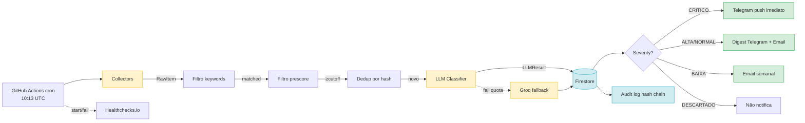

# ARCHITECTURE.md

Documentação arquitetural do MonitorITCD em níveis C4 (Context, Container, Component).

## Visão geral

Sistema **headless single-user** que monitora 27 entes federativos brasileiros
em busca de mudanças legislativas, normativas e jurisprudenciais sobre 3 temas:

- **ITCD/ITCMD/ITD** (tributário)
- **Direito das Sucessões** (CC arts. 1.784+)
- **Regime de Bens** (CC arts. 1.639-1.688)

## Pipeline (Mermaid — Sugestão #40)



## C4 Level 1 — Context

```
                ┌─────────────────────────────┐
                │    Donos (1 pessoa única)   │
                │  Telegram + E-mail + Bot    │
                └──────────────┬──────────────┘
                               │
                  ┌────────────▼────────────┐
                  │     MonitorITCD         │
                  │  (Backend autônomo)     │
                  └──┬─────────┬─────────┬──┘
                     │         │         │
            ┌────────▼──┐  ┌──▼───┐  ┌──▼──────────┐
            │ 100+ fontes│  │ LLM  │  │  Firebase   │
            │ govern. BR │  │Gemini│  │ + Functions │
            └────────────┘  └──────┘  └─────────────┘
```

## C4 Level 2 — Containers

| Container | Tecnologia | Responsabilidade |
|---|---|---|
| GitHub Actions runner | Ubuntu | Cron diário, executa pipeline |
| Coletores | Python async (httpx) | Buscam dados de 100+ fontes |
| Filtro pré-LLM | Python (regex) | Heurística antes de pagar LLM |
| LLM Classifier | Gemini Flash → Groq fallback | Classifica + extrai metadados |
| Storage | Firestore (Firebase Spark) | Metadados, watch list, audit log |
| Storage bruto | Firebase Storage | HTML/PDF originais |
| Notifiers | Email SMTP + Telegram Bot API | Email + Telegram + multi-canal |
| Bot Telegram | Cloud Function (us-central1) | Webhook recebe comandos |
| Proxy BR | Cloud Function (southamerica-east1) | Bypass geo-restricted |
| Dashboard | GitHub Pages | HTML estático com métricas |

## C4 Level 3 — Componentes (módulos Python)

```
src/monitoritcd/
├── core/              # Models pydantic, config, sanitize
├── collectors/        # Generic + custom (SAPL, ALEP, ALMG, etc.)
├── filters/           # Prescore + thematic_detector + LLM classifier
├── llm/               # Gemini, Groq, fallback
├── storage/           # Firestore + InMemory + audit_log
├── notifiers/         # Email + Telegram + multi-channel + feeds + ICS
├── bot/               # Handlers (start/help/buscar/...) + webhook
├── security/          # URL validator, markdown_escape, log_redactor, PII redactor, injection detector
├── analytics.py       # Trending, top sources, gap analysis, scores
├── search.py          # Faceted, boolean, fuzzy, regex search
├── watches.py         # Watch matching engine + templates
├── source_health.py   # Health score, auto-disable, revision calendar
├── source_validators.py # Lint domain rules
├── metrics.py         # ExecutionMetrics + Prometheus/JSON exporters
├── orchestrator.py    # Pipeline completa (collect → filter → classify → notify)
└── main.py            # CLI entry point (run/reprocess)
```

## Fluxo de dados (pipeline diário)

```
Cron 10:13 UTC
  ↓
load_active_states (Firestore)
  ↓
collectors.collect_all (asyncio.gather, ~30s)
  ↓
filter.prescore (cutoff 0.3)
  ↓
filter.llm_classifier (batch ≤10)
  ↓
storage.save_documento (write-once original)
  ↓
notifiers.dispatch (email + telegram + multi-channel)
  ↓
audit_log.append (hash chain)
```

## Decisões arquiteturais (ADRs)

Ver `docs/adr/`:
- ADR-0001: Firebase como storage primário (vs PostgreSQL)
- ADR-0002: Single-user com hardcoded owner_id
- ADR-0003: Async + httpx em vez de requests síncrono
- ADR-0004: pydantic em todas as fronteiras

## Fluxo de segurança (defense-in-depth)

Ver [SECURITY.md](../SECURITY.md).

Camadas, em ordem:
1. URL validator (anti-SSRF) na carga do YAML
2. HTTP timeout 30s + rate limit por host
3. HTML/PDF sanitizer antes do Storage
4. Pydantic com `extra="forbid"` em toda fronteira
5. Owner_id assertion antes de qualquer mutation
6. Audit log com hash chain
7. App Check no Firestore/Storage
8. Firestore Rules `deny all` (apenas SA acessa)

## Pontos de extensão

- **Nova fonte**: criar YAML em `sources/{UF}/`. Sem código (declarativo).
- **Novo coletor custom**: subclasse `BaseCollector` em `collectors/custom/`.
- **Novo notifier**: implementar Protocol `ChannelNotifier` em `notifiers/multi_channel.py`.
- **Novo handler bot**: adicionar em `bot/handlers_extra.py` + registrar em `EXTRA_HANDLERS`.
